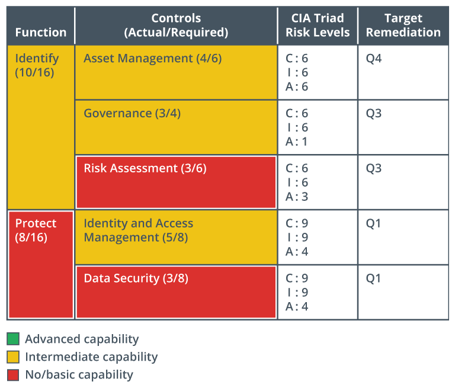

Cada función de seguridad está asociada con una serie de objetivos o resultados. Por ejemplo, un resultado de la función Identificar es un inventario de los activos propiedad y operados por la empresa. Los resultados se logran implementando uno o más **controles de seguridad**.

Numerosas categorías y tipos de controles de seguridad cubren una vasta gama de funciones. Esto dificulta la selección de controles apropiados y efectivos.

Un marco de ciberseguridad guía la selección y configuración de controles. Los marcos son importantes porque evitan que una organización construya su programa de seguridad en el vacío, o que lo construya sobre una base que no tiene en cuenta conceptos de seguridad importantes.

El uso de un marco permite a una organización hacer una declaración objetiva de sus capacidades actuales de ciberseguridad, identificar un nivel objetivo de capacidad y priorizar las inversiones para alcanzar ese objetivo. Esto da una estructura a los procedimientos internos de gestión de riesgos y proporciona una declaración externamente verificable de cumplimiento normativo.

El **análisis de brechas** es un proceso que identifica cómo los sistemas de seguridad de una organización se desvían de aquellos requeridos o recomendados por un marco. Esto se realizará al adoptar un marco por primera vez o al cumplir con un nuevo requisito de cumplimiento legal o de la industria. El análisis podría repetirse cada pocos años para cumplir con los requisitos de cumplimiento o para validar cualquier cambio que se haya realizado en el marco.

Para cada sección del marco, un informe de análisis de brechas proporcionará una puntuación general, una lista detallada de los controles faltantes o mal configurados asociados con esa sección, y recomendaciones para la remediación.

*Resumen de los hallazgos del análisis de brechas mostrando el número de controles recomendados no implementados por función y categoría; además de los riesgos para la confidencialidad, integridad y disponibilidad de los controles faltantes; y la fecha objetivo de remediación.*

> Los encabezados de las columnas son función, controles (actual/requerido), niveles de riesgo de la Tríada C I A y remediación objetivo. La función, identificar (10/16) tiene capacidad intermedia. Sus tres controles, junto con sus capacidades, niveles de riesgo de la Tríada CIA y remediación objetivo son los siguientes: Gestión de activos (4/6): Capacidad intermedia; C:6, I:6, A:6; T4 Gobernanza (3/4): Capacidad intermedia; C:6, I:6, A:1; T3 Evaluación de riesgos (3/6): Capacidad nula/básica; C:6, I:6, A:3; T3 La función, proteger (8/16) tiene capacidad nula/básica. Sus dos controles, junto con sus capacidades, niveles de riesgo de la Tríada CIA y remediación objetivo son los siguientes: Gestión de identidad y acceso (5/8): Capacidad intermedia; C:9, I:9, A:4; T1 Seguridad de datos (3/8): Capacidad nula/básica; C:9, I:9, A:4; T1

:::warning Advertencia

Si bien parte o todo el trabajo involucrado en el análisis de brechas podría ser realizado por el equipo de seguridad interno, es probable que un análisis de brechas involucre a consultores externos. Los marcos y los requisitos de cumplimiento de regulaciones y legislación pueden ser lo suficientemente complejos como para requerir un especialista. El asesoramiento y la retroalimentación de una parte externa pueden alertar al equipo de seguridad interno sobre descuidos y sobre nuevas tendencias y cambios en las mejores prácticas.

:::

## Glosario

- **Controles de seguridad**: Una tecnología o procedimiento implementado para mitigar vulnerabilidades y riesgos y para garantizar la confidencialidad, integridad y disponibilidad (CIA) de la información.
- **Análisis de brechas**: Un análisis que mide la diferencia entre el estado actual y el estado deseado para ayudar a evaluar el alcance del trabajo incluido en un proyecto.
