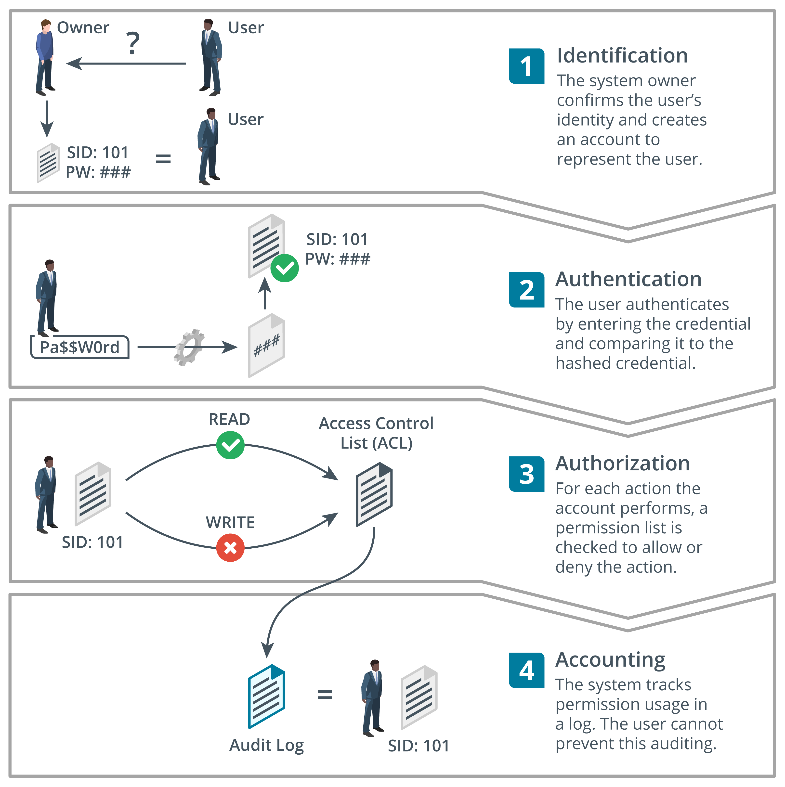

Un sistema de control de acceso asegura que un sistema de información cumpla los objetivos de la tríada CIA. El control de acceso rige cómo los sujetos/principales pueden interactuar con los objetos. Los sujetos son personas, dispositivos, procesos de software o cualquier otro sistema que pueda solicitar y obtener acceso a un recurso. Los objetos son los recursos. Un objeto podría ser una red, un servidor, una base de datos, una aplicación o un archivo. A los sujetos se les asignan derechos o permisos sobre los recursos.

El control de acceso moderno se implementa típicamente como un sistema de **gestión de identidad y acceso (IAM)**. IAM comprende cuatro procesos principales:

- **Identificación**: Creación de una cuenta o ID que representa de manera única al usuario, dispositivo o proceso en la red.
- **Autenticación**: Probar que un sujeto es quien o lo que afirma ser cuando intenta acceder al recurso. Un factor de autenticación determina qué tipo de credencial puede usar el sujeto. Por ejemplo, las personas pueden autenticarse proporcionando una contraseña; un sistema informático podría autenticarse utilizando un token como un certificado digital.
- **Autorización**: Determinar qué derechos deben tener los sujetos sobre cada recurso y hacer cumplir esos derechos. Un modelo de autorización determina cómo se otorgan estos derechos. Por ejemplo, en un modelo discrecional, el propietario del objeto puede asignar derechos. En un modelo obligatorio, los derechos están predeterminados por reglas impuestas por el sistema y no pueden ser cambiados por ningún usuario dentro del sistema.
- **Auditoría**: Seguimiento del uso autorizado de un recurso o del uso de derechos por parte de un sujeto y alertar cuando se detecta o intenta un uso no autorizado.

*Diferencias entre identificación, autenticación, autorización y auditoría.*

> Los procesos son los siguientes:
>
> 1. **Identificación**: El propietario del sistema confirma la identidad del usuario y crea una cuenta para representar al usuario.
> 2. **Autenticación**: El usuario se autentica ingresando la credencial y comparándola con la credencial hasheada.
> 3. **Autorización**: Para cada acción que realiza la cuenta, se verifica una lista de permisos para permitir o denegar la acción. Las acciones pueden incluir leer o escribir; la lista verificada es la Lista de Control de Acceso (A C L).
> 4. **Auditoría**: El sistema rastrea el uso de permisos en un registro. El usuario no puede impedir esta auditoría.

:::warning Advertencia

Los servidores y protocolos que implementan estas funciones también pueden denominarse **autenticación, autorización y auditoría (AAA)**. El uso de IAM para describir flujos de trabajo de seguridad empresarial se está volviendo más prevalente a medida que se reconoce mejor la importancia del proceso de identificación.

:::

Por ejemplo, si estás configurando un sitio de comercio electrónico y quieres registrar usuarios, necesitas seleccionar los controles apropiados para realizar cada función:

- **Identificación**: asegurar que los clientes sean legítimos. Por ejemplo, es posible que debas verificar que las direcciones de facturación y entrega coincidan y que no estén intentando utilizar métodos de pago fraudulentos.
- **Autenticación**: asegurar que los clientes tengan cuentas únicas y que solo ellos puedan gestionar sus pedidos e información de facturación.
- **Autorización**: reglas para asegurar que los clientes puedan realizar pedidos solo cuando tengan mecanismos de pago válidos. Podrías operar esquemas de fidelización o promociones que autoricen a ciertos clientes a ver ofertas o contenido únicos.
- **Auditoría**: el sistema debe registrar las acciones que realiza un cliente (para asegurar que no pueda negar haber realizado un pedido, por ejemplo).

:::warning Advertencia

Recuerda que estos procesos se aplican tanto a personas como a sistemas. Por ejemplo, necesitas asegurar que tu servidor de comercio electrónico pueda autenticar su identidad cuando los clientes se conecten a él usando un navegador web.

:::

## Glosario

- **Gestión de Identidad y Acceso (IAM)**: Un proceso de seguridad que proporciona mecanismos de identificación, autenticación y autorización para que usuarios, computadoras y otras entidades trabajen con activos organizacionales como redes, sistemas operativos y aplicaciones.
- **Identificación**: El proceso mediante el cual se asigna una cuenta de usuario (y sus credenciales) a la persona correcta. A veces se refiere como registro.
- **Autenticación**: Un método para validar las credenciales únicas de una entidad o individuo en particular.
- **Autorización**: El proceso de determinar qué derechos y privilegios tiene una entidad particular.
- **Auditoría**: Seguimiento del uso autorizado de un recurso o del uso de derechos por parte de un sujeto y alertar cuando se detecta o intenta un uso no autorizado.
- **Autenticación, autorización y auditoría (AAA)**: Seguimiento del uso autorizado de un recurso o del uso de derechos por parte de un sujeto y alertar cuando se detecta o intenta un uso no autorizado. (Nota: La definición de AAA parece ser idéntica a la de Auditoría en el texto original. La he traducido tal cual, pero es una observación).
