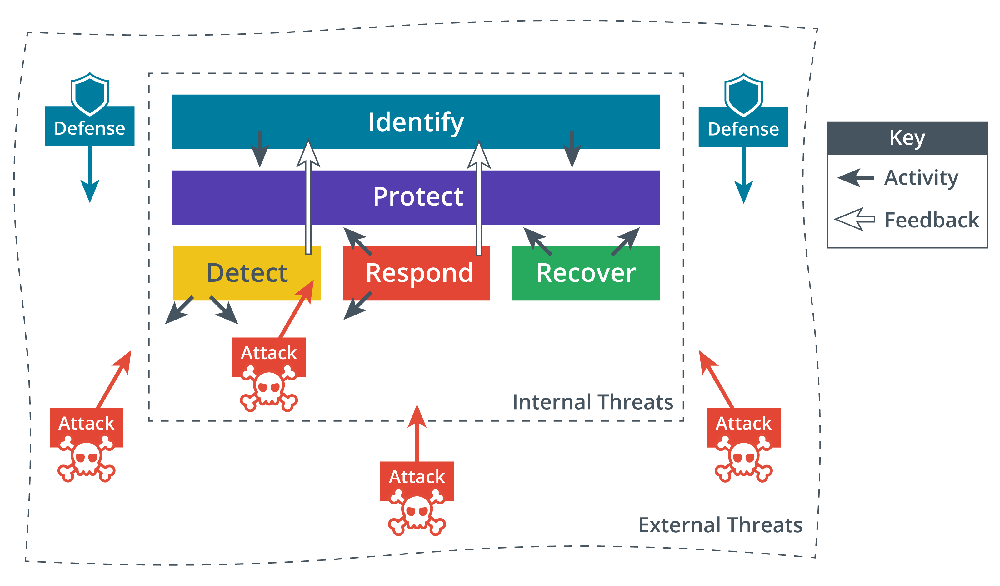

Dentro del objetivo de garantizar la seguridad de la información, la ciberseguridad se refiere específicamente a la provisión de hardware y software de procesamiento seguros. Las tareas de seguridad de la información y ciberseguridad pueden clasificarse en cinco funciones, siguiendo el marco desarrollado por el [Instituto Nacional de Estándares y Tecnología (NIST)](https://www.nist.gov/cyberframework/online-learning/five-functions):

- **Identificar** — desarrollar políticas y capacidades de seguridad. Evaluar riesgos, amenazas y vulnerabilidades y recomendar controles de seguridad para mitigarlos.
- **Proteger** — adquirir/desarrollar, instalar, operar y retirar activos de hardware y software de TI con la seguridad como un requisito incrustado en cada etapa del ciclo de vida de esta operación.
- **Detectar** — realizar monitoreo continuo y proactivo para asegurar que los controles sean efectivos y capaces de proteger contra nuevos tipos de amenazas.
- **Responder** — identificar, analizar, contener y erradicar amenazas a la seguridad de sistemas y datos.
- **Recuperar** — implementar resiliencia de ciberseguridad para restaurar sistemas y datos si otros controles no pueden prevenir ataques.

> Desde la parte superior, las funciones divididas en tres niveles son las siguientes: Identificar; proteger; y detectar, responder y recuperar. En la línea interna de amenazas, las actividades tienen lugar desde la detección de ataques; desde la identificación hasta la protección; y desde la respuesta y recuperación hasta la protección. La retroalimentación actúa desde la detección y respuesta a la identificación. La defensa contra los ataques de las amenazas funciona a nivel de identificación, en la línea externa de amenazas.

:::warning Advertencia

El marco de NIST es solo un ejemplo. Existen muchos otros marcos de ciberseguridad (**CSF**).
:::

## Glosario

- **CSF (Cybersecurity Framework)**: Estándares, mejores prácticas y directrices para la gestión eficaz del riesgo de seguridad. Algunos marcos son de naturaleza general, mientras que otros son específicos para tipos de industria o tecnología.
